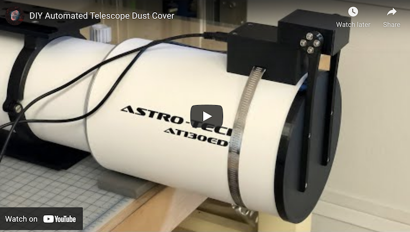
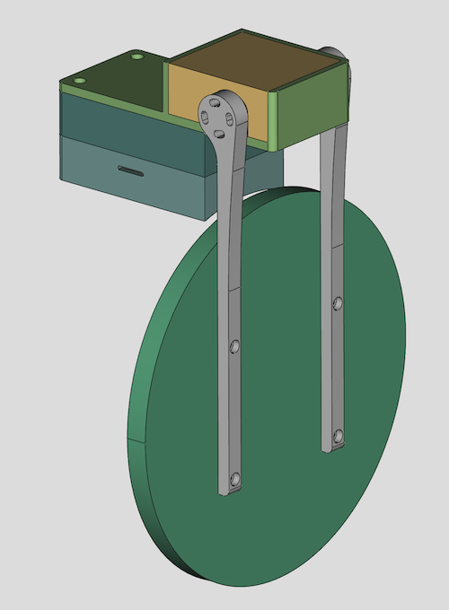
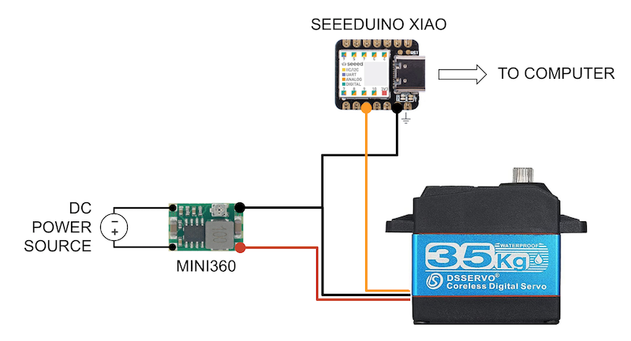
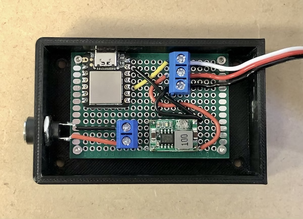

# Automated Telescope Dust Cover

- [Introduction](#introduction)
- [Pre-Requisites](#pre-requisites)
- [Hardware](#hardware)
- [Compiling The ASCOM Driver](#compiling-the-ascom-driver)
- [Compiling The Arduino Firmware](#compiling-the-arduino-firmware)
- [Mechanical Components](#mechanical-components)
- [Electronic Circuit](#electronic-circuit)
- [Ideas For Future Improvements](#ideas-for-future-improvements)

## Introduction

This repository contains code that allows you to build your own automated telescope dust cover. Here is a short demo video of the finished product, hosted on YouTube. Check it out!

In this repository, you will find:

* The code for the ASCOM driver (Microsoft Visual Studio 2022 project)
* The code for the Arduino firmware
* The various STL files to 3D print all the mechanical parts
* A blueprint for the electronic circuit

## Pre-Requisites

* A Windows computer (I know what you're thinking... The good news is that with [ASCOM Alpaca](https://www.ascom-standards.org/Developer/Alpaca.htm), we will soon have a truly multi-platform solution...)
* [Microsoft Visual Studio](https://visualstudio.microsoft.com/) (FYI, I used the 2022 edition...)
* [ASCOM Platform](https://ascom-standards.org/)
* [ASCOM Platform Developer Components](https://ascom-standards.org/COMDeveloper/Index.htm)
* [Arduino IDE](https://www.arduino.cc/en/software)
* [FreeCAD](https://www.freecadweb.org/), a free and open-source 3D parametric modeler
* A 3D printer able to print PETG, and a slicer (I use a heavily upgraded Creality Ender 3 v2, and Ultimaker Cura)
* A few basic tools that any tinkerer must own...

## Hardware

The following are just suggestions... Also, over time, some of the Amazon links may no longer work... But it should help get you started.

* [Seeeduino XIAO](https://www.amazon.com/dp/B08CN5YSQF)
* [Mini360 Buck Converters](https://www.amazon.com/dp/B07T7L51ZW)
* [Perforated Circuit Board (PCB)](https://www.amazon.com/dp/B07NM68FXK)
* [DC Power Jack](https://www.amazon.com/dp/B01N8VV78D)
* [High torque quality Servo with 270° control angle](https://www.amazon.com/dp/B07S9XZYN2)
* [Aluminum Servo Horn](https://www.amazon.com/dp/B07D56FVK5)
* [Bench Power Supply](https://www.amazon.com/dp/B07GCJ5QHF)
* [Threaded inserts for 3D printed parts](https://www.amazon.com/dp/B07VFZWWXY)
* [Assortment of small metric screws, nuts, and washers](https://www.amazon.com/dp/B08JCKH31Q)
* [22AWG solid core electrical wires](https://www.amazon.com/dp/B088KQFHV7)
* [Easy-to-print PETG filament](https://www.amazon.com/dp/B07PGYHYV8)
* [Stainless steel cut-to-length hose clamp](https://www.amazon.com/dp/product/B08Y6LSL3R)

## Compiling The ASCOM Driver

Open Microsoft Visual Studio as an administrator (right click on the Microsoft Visual Studio shortcut, and select "Run as administrator") This is required because when building the code, by default, Microsoft Visual Studio will register the necessary COM components, and this operation requires special privileges (Note: This is something you can disable in the project settings...) Then, open the solution (`ASCOM_Driver\ASCOM_Driver.sln`), change the solution configuration to `Release` (in the toolbar), open the `Build` menu and click on `Build ASCOM Driver`. As long as you have properly installed all the required dependencies, the build should succeed and the ASCOM driver will be registered on your system.

## Compiling The Arduino Firmware

* Add support for Seeeduino boards by following [the instructions from the board manufacturer](https://wiki.seeedstudio.com/Seeeduino-XIAO/).
* To customize the name of the device when connected to your computer, open the file `boards.txt`, which, on my system and for the version of the Seeeduino board I am using, is located at `%LOCALAPPDATA%\Arduino15\packages\Seeeduino\hardware\samd\1.8.2\boards.txt`. Then, change the value of the key `seeed_XIAO_m0.build.usb_product` from `Seeed XIAO M0` (default) to whatever you'd like.
* Finally, connect your Seeeduino board to your computer (make sure you use a USB-C cable that supports data and not just power!), open the sketch file located at `Arduino_Firmware\Arduino_Firmware.ino`, and click on the `Upload` button in the toolbar.

## Mechanical Components

Here is a 3D rendering of all the parts involved in this project:

The STL files you will find in the `3D_Files/` folder are just a starting point. You will likely have to create your own version of this project, if only to match the base curvature to your own OTA... That is why I included the FreeCAD file in this repository! (also in the `3D_Files/` folder)

## Electronic Circuit

Here is what the electronic circuit looks like:

In the photograph above, the components were soldered onto a 60mm x 40mm PCB.

## Ideas For Future Improvements

* Remove the need for a separate 12V power connector, i.e. use the USB cable for both data and power. This change would prevent us from using an Arduino-compatible board because the maximum current that can be delivered by an Arduino-compatible board is usually around 200mA, which is not enough for a powerful servo. In order to do this, you'd have to basically build your own Arduino board using a micro-controller, a USB jack, a USB driver, and many other components... It's quite a project on its own, which is why I decided to go the "easy" route...
* Integrate a flat field panel inside the cover. I wanted to keep this project relatively simple, so I skipped that, but it can be done and would be a great addition to this project!
